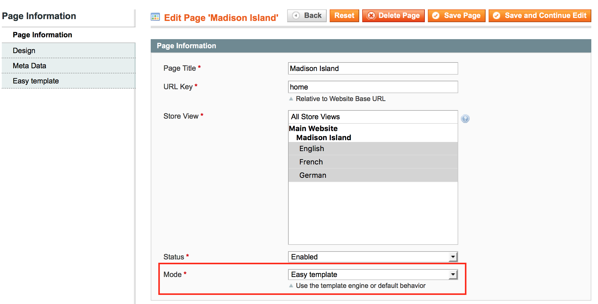
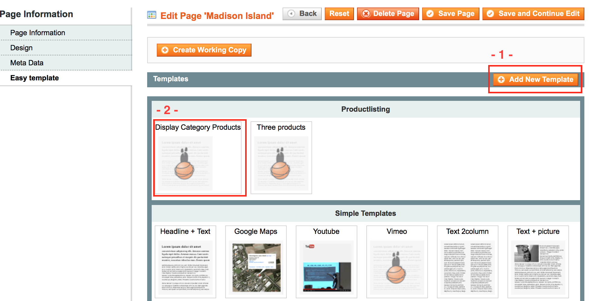

# EasyTemplate

---------------------------------------------------------------------------------

## General

EasyTemplate is a enhancement for Magento CMS Pages which cut ups all elements of your cms-pages in single bricks.
Each brick could have several input-elements. Each brick could placed any number of times and in a any sortation - 
without any html skills!

## To prove itself in practice

Customers marketing leader is going to optimize shops homepage. 
Normally he is going to plan all new elements, describe it and give to a developer.
Using EasyTemplate he can do it by himself.

### 1. Open CMS Page

First of all open cms page and select "EasyTemplate" as display-mode.
Now your page-rending is replaced by EasyTemplate.

### 2. Add a Template

At this moment your homepage is empty. You have to place your first template by switching to tab "Easy template" 
and pressing button "Add New Template".

In this example we select "Display Category Products" to show some products in a line.

